# ghstats — gruvbox

[← back to index](../README.md)

Rendered for [`tiennm99`](https://github.com/tiennm99). 15 SVGs below, grouped so the last-year / all-time pairs sit next to each other.

## At-a-glance

### Profile

### Stats

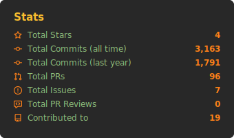

### Streak

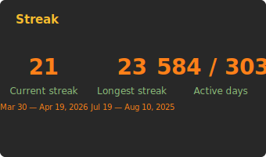

## Repos

### Top starred

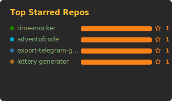

### Repos per language

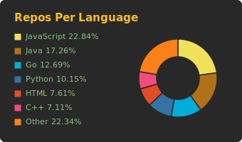

## Contributions — time series

### Calendar heatmap (last year)

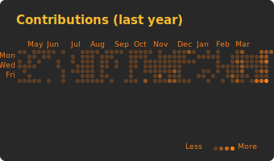

### By year (all time)

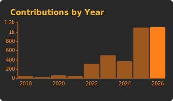

### Monthly shape

<table><tr><th>Last year</th><th>All time</th></tr><tr>
<td>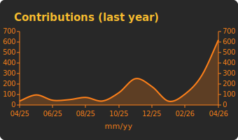</td>
<td>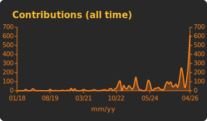</td>
</tr></table>

## When you commit

### By hour of day

<table><tr><th>Last year</th><th>All time</th></tr><tr>
<td>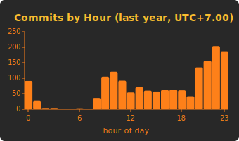</td>
<td>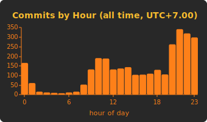</td>
</tr></table>

### By day of week

<table><tr><th>Last year</th><th>All time</th></tr><tr>
<td>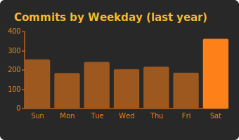</td>
<td>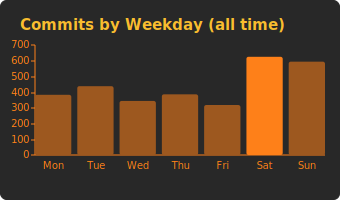</td>
</tr></table>

## What you commit in

### Byte-weighted language share

<table><tr><th>Last year</th><th>All time</th></tr><tr>
<td>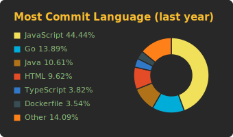</td>
<td>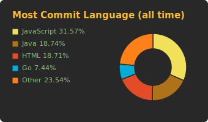</td>
</tr></table>

