# ghstats — transparent

[← back to index](../README.md)

Rendered for [`tiennm99`](https://github.com/tiennm99). 15 SVGs laid out to match the author profile README table.

<table>
<tr><td></td><td>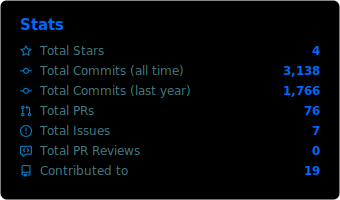</td></tr>
<tr><td>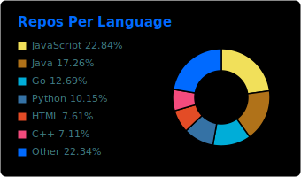</td><td>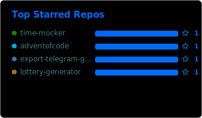</td></tr>
<tr><td>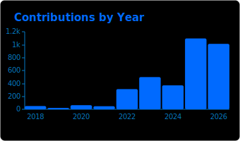</td><td>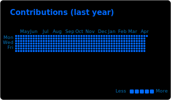</td></tr>
<tr><td colspan="2" align="center">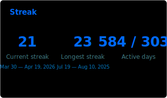</td></tr>
<tr><th>Last year</th><th>All time</th></tr>
<tr><td>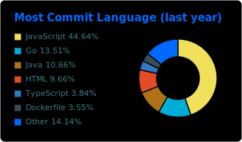</td><td>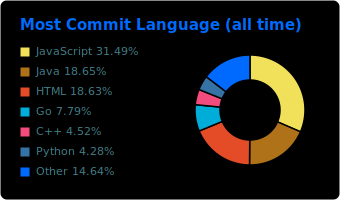</td></tr>
<tr><td>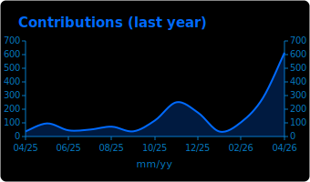</td><td>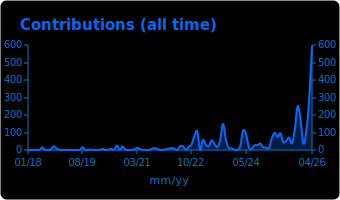</td></tr>
<tr><td>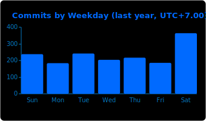</td><td>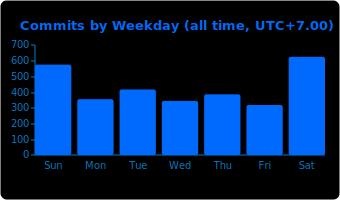</td></tr>
<tr><td>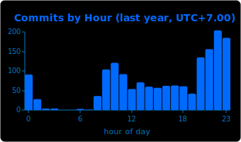</td><td>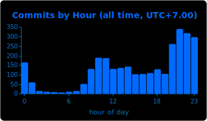</td></tr>
</table>

